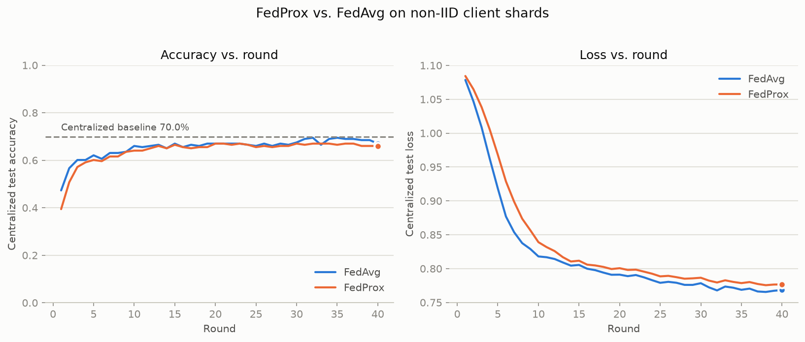
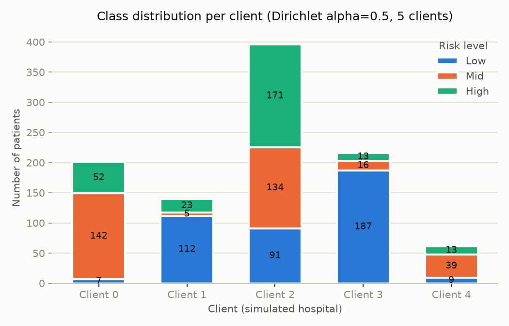

# Janani-Net

Predicting maternal health risk (Low / Mid / High) from 6 vitals, using
**Federated Learning** instead of the usual "pool everyone's data and train
one model" approach.

## The problem, in plain terms

You want to predict pregnancy risk level from simple vitals — age, blood
pressure, blood sugar, body temperature, heart rate. The obvious approach:
collect patient records from every hospital into one place and train a
model on all of it. Two problems with that:

1. **Privacy/legal** — hospitals can't just hand over raw patient records
   to a central server.
2. **Bias** — even if they could, a model trained mostly on one hospital's
   patients ends up tuned to that hospital's population and performs worse
   for everyone else, since different hospitals/clinics see different
   patient mixes.

## The fix: Federated Learning

Instead of hospitals sending data to one place, **each hospital keeps its
data at home**, trains the same model locally, and only sends the model's
*learned weights* (numbers, not patient info) to a central server. The
server averages every hospital's weights into one improved global model,
sends it back out, and repeats for several rounds. No raw data ever
leaves the building.

We don't have 5 real hospitals, so we simulate them: split one public
dataset into 5 skewed chunks (one **Dirichlet distribution** knob, `alpha`,
controls how skewed) so each "hospital" sees a different risk-level mix —
this is what makes it a meaningful test of federated learning rather than
a toy example.

## What's in this repo

| Step | What it does | Code |
|---|---|---|
| 1 | Get the data | `data/raw/maternal_health_risk.csv` — 1014 real records, [UCI ML Repository](https://archive.ics.uci.edu/dataset/863/maternal+health+risk) |
| 2 | Clean it | `src/preprocessing.py` — scale vitals to 0-1, encode risk labels |
| 3 | Simulate 5 non-IID hospitals | `src/partition.py` — Dirichlet-skewed split |
| 4 | Build + sanity-check the model | `src/model.py` (PyTorch MLP) + `scripts/train_baseline.py` |
| 5 | Wrap it for federated training | `src/fl_client.py` — [Flower](https://flower.ai/) `NumPyClient`, with FedProx's regularization term |
| 6 | Run federated rounds | `scripts/run_fl.py` — drives the multi-round loop |
| 7 | Compare strategies | `scripts/compare_strategies.py` — FedProx vs. FedAvg, same data, same rounds |

## Results

**Centralized baseline** (normal training, no federation, all data in one
place): **70.0% test accuracy**. This is the ceiling — the best case if
privacy weren't a concern at all.

**Federated** (5 non-IID hospitals, data never centralized), 40 rounds:

| Strategy | Peak accuracy | Final accuracy |
|---|---|---|
| FedAvg | 69.5% (round 32) | 67.0% |
| FedProx | 67.0% (round 20) | 66.0% |



**Headline result**: federated training reaches essentially the same
accuracy as centralized training within ~20-30 rounds — without any
hospital ever sharing a patient record — then plateaus with normal
training noise bouncing it a couple points either way, rather than
climbing further. FedAvg and FedProx land close together here; FedProx's
extra regularization term is expected to help more at *stronger* skew
than this run uses (see Notes below).

**The simulated non-IID hospitals** (5 clients, Dirichlet alpha=0.5) —
each has a visibly different risk-level mix, which is the whole point:



## Notes / honest caveats

- Single run, single seed — no averaging across multiple random splits, so
  there's real run-to-run variance not captured here.
- The dataset's "Mid risk" class inherently overlaps with Low and High in
  the raw vitals (visible in the baseline's per-class report — Mid recall
  is only 0.36 vs. 0.84/0.91 for Low/High); that ceiling is baked into
  every number above, not something federation makes worse.
- FedProx didn't clearly beat FedAvg at this moderate skew level
  (alpha=0.5) with uniform local computation across clients — its proximal
  term is a regularizer that's expected to matter more under stronger
  non-IID skew (lower alpha) or heterogeneous client compute.
- Flower's own simulation runner (`start_simulation`/`run_simulation`)
  requires the `ray` package, which has no build for Python 3.14 on
  Windows yet. `scripts/run_fl.py` works around this with a manual
  round-loop driver that still calls Flower's real `FedProx`/`FedAvg`
  strategy objects for aggregation — only the network/parallelism layer is
  swapped out, not the aggregation math. See the script's docstring.

**Not built** (planned for later phases): differential privacy (DP-SGD),
SHAP/LIME explainability, real edge/Raspberry Pi deployment, synthetic
data generation, a polished dashboard.

## Setup

```
python -m venv .venv
.venv\Scripts\activate
pip install -r requirements.txt
```

## Usage

```
python scripts/preprocess.py                 # scale + label-encode -> data/processed/
python scripts/partition_data.py              # non-IID client shards + distribution chart
python scripts/train_baseline.py              # centralized MLP baseline
python scripts/test_client.py                 # smoke-test the Flower client in isolation
python scripts/run_fl.py --strategy fedprox   # one federated run (fedavg or fedprox)
python scripts/compare_strategies.py          # both strategies + the comparison chart
```

Every script is a CLI with `--num-clients`, `--alpha`, `--num-rounds`, etc.
— defaults reproduce the numbers above exactly (fixed seed).

## Layout

```
data/raw/         committed, original UCI CSV, untouched
data/processed/   gitignored, regenerated by the scripts above
src/              importable modules: preprocessing, partition, model, fl_client
scripts/          runnable entry points, one per step above
figures/          committed presentation charts
```
